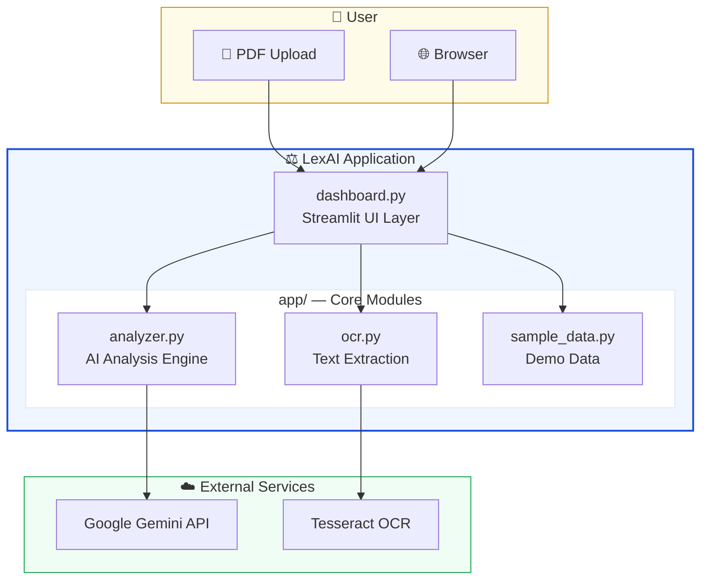
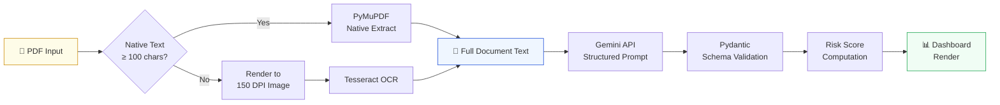
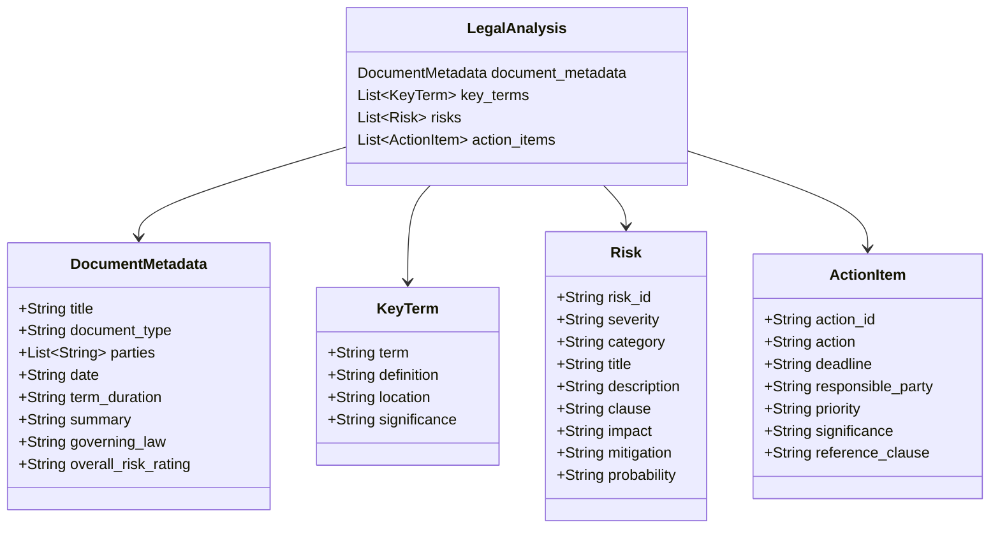
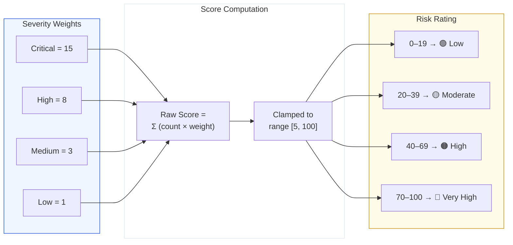
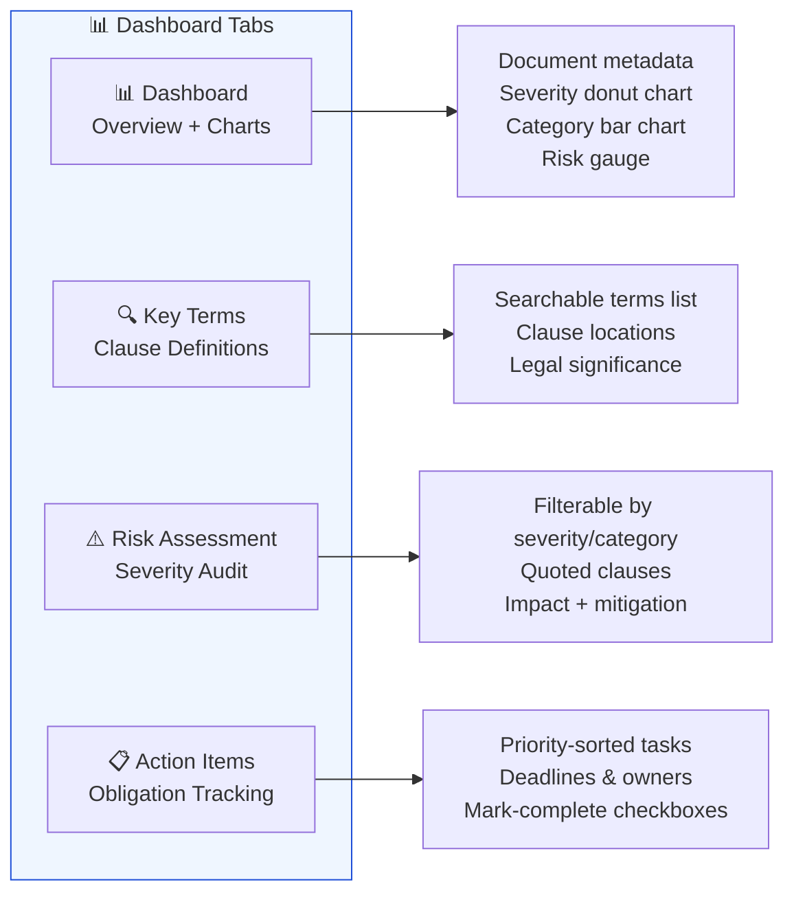
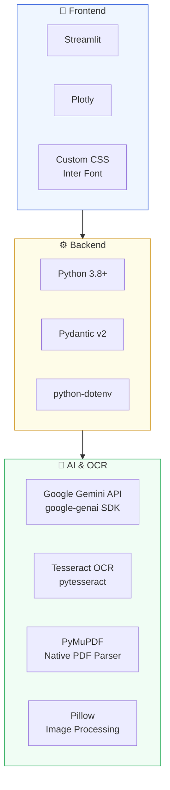

<](https://python.org)
[](https://streamlit.io)
[](https://ai.google.dev)
[](LICENSE)

[Features](#-features) · [Quick Start](#-quick-start) · [Architecture](#-architecture) · [Usage](#-usage) · [Tech Stack](#-tech-stack)

</div>

---

## 📋 Overview

**LexAI** is an end-to-end legal document analysis tool that combines OCR-based text extraction with Google Gemini's structured AI output to perform deep contract audits. Upload any PDF — native text or scanned — and receive a comprehensive risk assessment dashboard with:

- **Structured metadata extraction** (parties, dates, governing law, term duration)
- **Clause-by-clause risk profiling** with severity ratings, impact analysis, and mitigation strategies
- **Key terms & definitions** with legal significance annotations
- **Action item tracking** with deadlines, responsible parties, and priority levels
- **Interactive analytics** with donut charts, bar graphs, and a composite risk gauge

---

## ✨ Features

| Feature | Description |
|---|---|
| 🔍 **Hybrid Text Extraction** | Native PDF text via PyMuPDF + Tesseract OCR fallback for scanned pages |
| 🤖 **Gemini AI Analysis** | Structured JSON output using Pydantic schemas for validated, type-safe results |
| 📊 **Interactive Dashboard** | 4-tab Streamlit UI with Plotly charts — overview, key terms, risk audit, action items |
| ⚠️ **Risk Scoring Engine** | Composite risk score (0–100) with weighted severity calculation |
| 🔄 **Model Fallback Chain** | Automatic retry across 7 Gemini models if the primary model is unavailable |
| 📝 **Demo Mode** | Pre-loaded sample lease analysis — no API key required to explore the dashboard |
| 🎨 **Professional UI** | Custom CSS with Inter font, color-coded severity pills, and responsive cards |

---

## 🏗 Architecture

### System Overview



### Processing Pipeline



### AI Analysis Schema



### Risk Scoring Formula



---

## 🚀 Quick Start

### Prerequisites

| Requirement | Purpose |
|---|---|
| **Python 3.8+** | Runtime |
| **Tesseract OCR** *(optional)* | Required only for scanned PDFs |
| **Gemini API Key** | AI analysis — get one free at [Google AI Studio](https://aistudio.google.com/apikey) |

### Option 1: Automated Setup (Recommended)

```bash
# Clone the repository
git clone https://github.com/mohitUpraity/pbel-project.git
cd pbel-project

# Run the automated setup script
chmod +x setup.sh
./setup.sh
```

The setup script will:
1. Create a Python virtual environment
2. Install all dependencies from `requirements.txt`
3. Create a `.env` file from `.env.example`
4. Run diagnostics and launch the app

### Option 2: Manual Setup

```bash
# Clone the repository
git clone https://github.com/mohitUpraity/pbel-project.git
cd pbel-project

# Create and activate virtual environment
python3 -m venv venv
source venv/bin/activate

# Install dependencies
pip install -r requirements.txt

# Configure environment
cp .env.example .env
# Edit .env and add your GEMINI_API_KEY

# Launch the app
streamlit run dashboard.py
```

### Install Tesseract (Optional — for scanned PDFs)

```bash
# macOS
brew install tesseract

# Ubuntu / Debian
sudo apt-get install tesseract-ocr

# Windows
# Download from: https://github.com/UB-Mannheim/tesseract/wiki
# Then set TESSERACT_CMD in .env to the install path
```

---

## 🔧 Configuration

All configuration is managed through the `.env` file:

```env
# Required — Google Gemini API Key
GEMINI_API_KEY=your_gemini_api_key_here

# Optional — Path to Tesseract executable
TESSERACT_CMD=/usr/local/bin/tesseract
```

You can also enter the API key directly in the sidebar at runtime — it takes precedence over the `.env` value.

---

## 📖 Usage

### Upload & Analyze

1. **Launch the app** → `streamlit run dashboard.py` or `python run.py`
2. **Enter your Gemini API key** in the sidebar (or set it in `.env`)
3. **Upload a PDF** — drag and drop any legal document
4. **Wait for analysis** — extraction + AI analysis typically takes 15–30 seconds
5. **Explore the dashboard** across 4 tabs

### Dashboard Tabs



### Try the Demo

Click **"Load Sample Lease →"** on the home page to explore a pre-analyzed commercial lease agreement without needing an API key.

---

## 📂 Project Structure

```
pbel-project/
├── dashboard.py            # Main Streamlit application (UI + routing)
├── run.py                  # Launcher with dependency checks & diagnostics
├── setup.sh                # Automated setup script (venv + deps + config)
├── requirements.txt        # Python dependencies
├── .env.example            # Environment variable template
├── .gitignore              # Git ignore rules
│
├── app/                    # Core application modules
│   ├── __init__.py         # Package marker
│   ├── ocr.py              # PDF text extraction (PyMuPDF + Tesseract)
│   ├── analyzer.py         # Gemini AI analysis with Pydantic schemas
│   └── sample_data.py      # Pre-built demo analysis data
│
└── .streamlit/             # Streamlit configuration
    ├── config.toml         # Theme colors & settings
    └── credentials.toml    # Telemetry opt-out
```

---

## 🛠 Tech Stack



| Layer | Technology | Version |
|---|---|---|
| **UI Framework** | Streamlit | ≥ 1.35.0 |
| **Charts** | Plotly | ≥ 5.18.0 |
| **AI Engine** | Google Gemini (`google-genai`) | ≥ 1.0.0 |
| **PDF Parser** | PyMuPDF | ≥ 1.24.0 |
| **OCR** | pytesseract + Tesseract | ≥ 0.3.10 |
| **Image Processing** | Pillow | ≥ 10.0.0 |
| **Schema Validation** | Pydantic | ≥ 2.0.0 |
| **Environment** | python-dotenv | ≥ 1.0.0 |

---

## 🤖 Model Fallback Chain

LexAI uses a cascading model strategy. If the primary model is unavailable, it automatically tries the next one:

```
gemini-3.1-flash-lite-preview  (default)
       ↓
gemini-3.1-flash-lite
       ↓
gemini-3-flash-preview
       ↓
gemini-2.5-flash
       ↓
gemini-2.0-flash
       ↓
gemini-2.0-flash-lite
       ↓
gemini-1.5-flash
```

You can also select any available model from the sidebar dropdown — the app dynamically fetches your account's available models from the Gemini API.

---

## 🔒 Security

- **API keys are never committed** — `.env` is in `.gitignore`
- **Keys entered in the sidebar** are stored only in Streamlit session state (ephemeral)
- **Document text is sent to Google Gemini API** — review [Google's AI data policies](https://ai.google.dev/terms) for compliance requirements
- **No data persistence** — uploaded documents and analysis results are discarded when the session ends

---

## 🐛 Troubleshooting

| Issue | Solution |
|---|---|
| `Tesseract not found` | Install Tesseract or set `TESSERACT_CMD` in `.env`. Native PDFs still work without it. |
| `Gemini API error: 404 not found` | The selected model may not be available in your region. The app will auto-fallback to the next model. |
| `Could not extract readable text` | The PDF may be image-only with very low resolution. Try a higher-quality scan. |
| `Analysis failed: API key not set` | Add your key to `.env` or enter it in the sidebar. Get one at [Google AI Studio](https://aistudio.google.com/apikey). |

---

## 📄 License

This project is open source and available under the [MIT License](LICENSE).

---

<div align="center">

**Built with ❤️ using Google Gemini AI & Streamlit**

</div>
]]>
